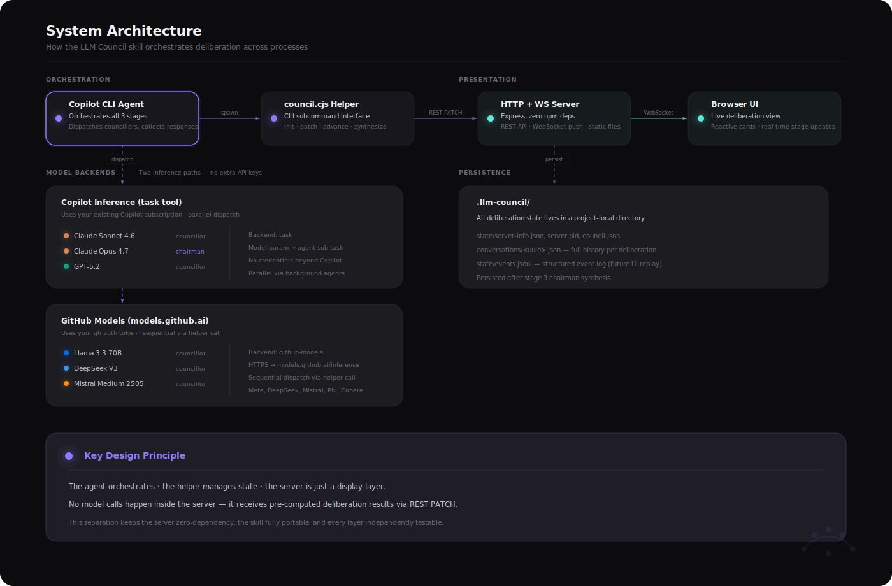
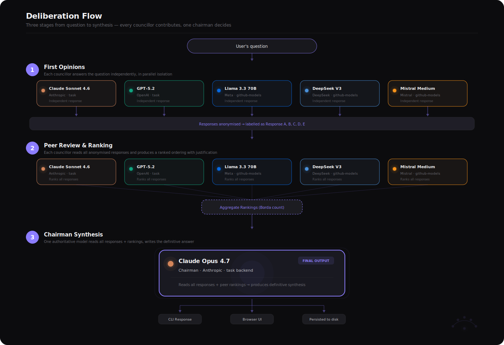

<p align="center">
  
</p>

<h1 align="center">LLM Council</h1>

<p align="center">
  Multi-model deliberation for GitHub Copilot CLI.<br/>
  Five models debate. One chairman synthesises. You watch it live.
</p>

<p align="center">
  <a href="#install">Install</a> · <a href="#how-it-works">How it works</a> · <a href="#usage">Usage</a> · <a href="#configuration">Configuration</a> · <a href="#development">Development</a>
</p>

---

## How it works

```
Question ──► 5 councillors answer in parallel (Stage 1)
                    │
                    ▼
         Responses anonymised (A, B, C, D, E)
                    │
                    ▼
         Each councillor ranks all responses (Stage 2)
                    │
                    ▼
         Rankings aggregated (Borda count)
                    │
                    ▼
         Chairman reads everything, writes synthesis (Stage 3)
                    │
                    ▼
         Final answer ──► CLI + Browser UI + Disk
```

A local web UI shows every stage unfolding in real time. No external API keys required — uses your existing Copilot subscription and `gh auth` token.

### Architecture

<p align="center">
  
</p>

### Deliberation flow

<p align="center">
  
</p>

## Default council

| Model | Vendor | Role | Backend |
|-------|--------|------|---------|
| Claude Sonnet 4.6 | Anthropic | Councillor | Copilot inference (`task`) |
| GPT-5.2 | OpenAI | Councillor | Copilot inference (`task`) |
| Llama 3.3 70B | Meta | Councillor | GitHub Models |
| DeepSeek V3 | DeepSeek | Councillor | GitHub Models |
| Mistral Medium 2505 | Mistral | Councillor | GitHub Models |
| **Claude Opus 4.7** | **Anthropic** | **Chairman** | Copilot inference (`task`) |

Two inference paths, zero extra credentials:
- **`task` backend** — models dispatched through Copilot's built-in inference (your subscription covers it)
- **`github-models` backend** — models called via `models.github.ai` using your `gh auth token`

## Install

```powershell
# 1. Install GitHub CLI (if you don't have it)
winget install GitHub.cli

# 2. Authenticate (required for model inference)
gh auth login

# 3. Clone and install the skill
git clone https://github.com/thevgavini/ghcp-llm-council.git
cd ghcp-llm-council
.\install-skill.ps1
```

Restart your Copilot CLI session after installing. Requires Node 20+ and GitHub Copilot CLI.

## Usage

In any Copilot CLI session:

```
ask the council: should we use a monorepo or polyrepo for our microservices?
```

The skill:
1. Asks you to pick a mode (general, review, design, plan, research)
2. Spins up a local server, opens the browser UI
3. Dispatches all councillors in parallel
4. Runs peer review + ranking
5. Chairman synthesises a final answer
6. Returns the synthesis in chat and persists to disk

### Follow-ups

```
follow up: what about the CI/CD complexity tradeoff?
```

Runs a fresh 3-stage deliberation on the existing conversation thread.

### File context

```
council: review src/auth.cjs for security holes
```

The skill auto-detects file references and passes them to every councillor inline.

## Modes

| Mode | Best for | Trigger words |
|------|----------|---------------|
| `general` | Open Q&A, opinions, explanations | _(default)_ |
| `review` | Code review, security audit | "review", "audit", "find bugs" |
| `design` | Architecture decisions, tech choices | "design", "should I use X or Y" |
| `plan` | Implementation roadmaps | "plan", "roadmap", "how would you build" |
| `research` | Deep dives, learning | "explain", "how does X work" |

Each mode has tuned prompts for councillors and chairman. Mode packs can override the council lineup (e.g., `review` mode uses Opus as both councillor and chairman).

## Configuration

Defaults: `skills/llm-council/defaults/council.json`  
Per-project override: `<cwd>/.llm-council/state/council.json`

```json
{
  "council": [
    {"id": "claude-sonnet-4.6", "vendor": "Anthropic", "display": "Claude Sonnet 4.6", "backend": "task"},
    {"id": "gpt-5.2",           "vendor": "OpenAI",    "display": "GPT-5.2",           "backend": "task"},
    {"id": "meta/llama-3.3-70b-instruct", "vendor": "Meta", "display": "Llama 3.3 70B", "backend": "github-models"}
  ],
  "chairman": "claude-opus-4.7",
  "chairman_backend": "task",
  "min_responses_to_proceed": 2,
  "councillor_timeout_seconds": 120
}
```

Add any model supported by Copilot inference or GitHub Models. The council scales to any size.

## Project structure

```
skills/llm-council/
├── SKILL.md              # Agent instructions (the skill contract)
├── bin/council.cjs       # CLI helper (init, patch, advance, synthesize)
├── server/               # Zero-dependency HTTP + WebSocket server
│   ├── start.cjs         # Entry point
│   └── public/           # Browser UI (vanilla JS, live cards)
├── defaults/council.json # Default model lineup
└── prompts/              # Mode-specific prompt templates
    ├── general/          # councillor.md + chairman.md
    ├── review/
    ├── design/
    ├── plan/
    └── research/
```

State lives in `<cwd>/.llm-council/` — add to `.gitignore`.

## Development

```bash
node skills/llm-council/server/start.cjs   # Launch server standalone for UI dev
node skills/llm-council/server/stop.cjs    # Tear down
```

Tests live on the `tests/suite` branch:

```bash
git checkout tests/suite
npm test
```

## Inspired by

[karpathy/llm-council](https://github.com/karpathy/llm-council) — the original multi-model deliberation concept. This project brings it into the Copilot CLI ecosystem with live visualisation, zero external credentials, domain-specific modes (review, design, plan, research) with tuned prompts, and a skill-native interface that runs entirely from your terminal.

## License

MIT — see [LICENSE](./LICENSE).

Bundles [marked](https://github.com/markedjs/marked) (MIT) and [DOMPurify](https://github.com/cure53/DOMPurify) (Apache-2.0 / MPL-2.0) in the frontend. Full notices in [`server/public/vendor/LICENSES/`](skills/llm-council/server/public/vendor/LICENSES/).
